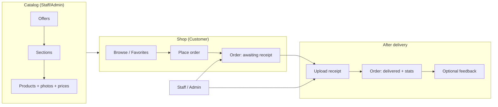

# Puff Plaza — User manual

This document explains how the **Puff Plaza** web application works for every role: what each person can do, how orders move through the system, and where to find main features. The interface is **bilingual (English / Arabic)** with a language toggle in the header.

For **installation**, environment variables, and developer setup, see the root **`README.md`**.

A printable **PDF** is kept at **`docs/USER_MANUAL.pdf`**. Regenerate it after editing this manual (requires **Google Chrome** or **Microsoft Edge**, and internet access for the workflow diagram): run `node scripts/export-user-manual-pdf.mjs` from the repository root.

---

## 1. Roles at a glance

| Role | Who they are | Main purpose |
|------|----------------|----------------|
| **Customer** | Registered buyer | Browse offers, place orders, upload delivery receipts, leave feedback, use favorites. |
| **Staff** | Operations team | Manage catalog (offers, sections, products), advertising, “How it works”, view all orders, copy order text, upload receipts for customers if needed, manage **customer** accounts, view statistics and overdue notifications. |
| **Admin** | System owner | Everything **Staff** can do, plus **system settings** (notification email, header social links, contact link), manage **staff and customer** accounts, and **delete orders** from the system. |

**Access rules (simplified)**

- **Customer** pages: My Orders, Favorites, Profile — only when logged in as a customer.
- **Staff panel** (`/staff/...`): Staff and Admin.
- **Admin settings** (`/admin/settings`): **Admin only**.
- **Manage accounts** (`/admin/users`): Staff and Admin (scope differs: Staff sees customers only; Admin sees staff + customers).

---

## 2. End-to-end order workflow

This is the main business flow shared by all roles.

1. **Staff/Admin** creates **offers** (with codes, delivery fee rules, optional **promo codes**), **sections** inside an offer, and **products** (name, price, photos, optional product-level promo).
2. **Customer** opens the **home page**, picks an offer, finds a product, and clicks **Order** (must be logged in, with **emirate** and **address** on profile for checkout).
3. The order is created in status **ordered** (awaiting delivery / receipt). A **new-order notification** can be sent to the configured notification email (see §7).
4. When the goods are delivered, **Customer** (or **Staff/Admin** on behalf of the customer) uploads a **receipt** (image or PDF). The order becomes **delivered** and contributes to **statistics**.
5. The customer may submit **feedback** on delivered orders.
6. **Admin** may **delete** an order entirely (rare correction path); Staff cannot delete orders.

**Promo / discount codes**

- Customers can enter an optional **promo code** at checkout if staff configured a matching code on the **product** or the **offer** (with valid expiry and discount percent).
- When a code is used, it is stored on the order and appears in **order notification email text** and in the **staff “copy order text”** block for traceability.

---

## 3. Customer guide

### 3.1 Account

- **Register**: name, phone, email, password, UAE **emirate**, delivery **address**.
- **Login** / **Logout** from the header.
- **Profile**: update name, phone, emirate, address, and password.

Without **emirate + address**, the site blocks placing an order and asks the customer to complete the profile first.

### 3.2 Shopping

- **Home**: lists **active offers**; search products; open an offer to see **sections** and **products**.
- **Product card**: shows price per unit, **Order now**, optional **favorite** heart, and **promo** badge when a valid promo exists on product or offer. If the product has **no photo**, the large image area is hidden.
- **Favorites**: saved products for quick access; order flow is the same as from the catalog.

### 3.3 Placing an order

- Click **Order now** on a product.
- Set **quantity**, optional **notes**, optional **promo code** (must match an active configured code or the order is rejected).
- Review **delivery fee** (from the offer’s fee schedule and quantity) and **estimated total**, then confirm.

After success, use **My Orders** to track the order.

### 3.4 After delivery

- **My Orders**:
  - For **ordered** status: read the hint and **Upload receipt** (jpg, png, or pdf within size limits).
  - For **delivered**: view receipt, optionally **remove receipt** (returns order to ordered — customer-only for removal), and submit **feedback** text.
- Customers **cannot** see other users’ orders.

### 3.5 Header (everyone)

- **Social icons** and **Contact us** appear when the **Admin** configured URLs in **Admin → System settings** (see §7).

---

## 4. Staff guide

Open **Staff panel** from the nav after login. The **dashboard** links to all staff tools.

### 4.1 Manage offers

- Create, edit, or **disable** offers (code, title, dates, delivery fee schedule, optional **offer-level promo**: code, expiry, discount %).
- **CSV import** of products is available at offer level where supported.

### 4.2 Sections & products

- For each offer: define **sections** (grouping), then **products** inside a section.
- Per product: names (AR/EN), prices, marketer fee, **photos**, active/inactive, optional **product-level promo**.
- Staff can **toggle** product active state and use **bulk** tools where provided.

### 4.3 Content

- **Advertising board**: create/edit slides shown on the landing page.
- **How it works**: edit the steps/content shown to visitors.

### 4.4 Operations

- **Order history**: all customers’ orders; **copy** formatted order text (similar to email content) for WhatsApp or manual processes; **upload receipt** for an **ordered** order if the customer did not; view receipts for **delivered** orders.
- **Notifications**: list **overdue** orders (past expected delivery / receipt flow — per app logic).
- **Statistics**: successful orders, totals, marketer fees, commission collected vs pending.
- **Mark commission**: use the commission toggle on an order where the UI exposes it (staff workflow for fee collection).

### 4.5 Accounts (Manage users)

- **Staff** may list/create/delete/**reset password** for **customers only**.
- **Staff cannot** create or delete **staff** or **admin** accounts.

---

## 5. Admin guide

Admin includes **all staff capabilities**, plus:

### 5.1 System settings (`/admin/settings`)

- **Notification email**: where **new order** and **receipt uploaded** notifications are sent (also related app settings in database).
- **Header links**: optional URLs for **Instagram, Facebook, TikTok, YouTube, X, Snapchat, WhatsApp**, and a **Contact us** link (shown in the site header when filled).
- **Social URLs** must be `http://` or `https://`. **Contact** may also be `mailto:` or `tel:`.

### 5.2 Manage users

- **Admin** sees **staff** and **customers** (not themselves in the list logic the same way — cannot delete self).
- Can create **staff** or **customer** accounts, delete users, reset passwords (per API rules).

### 5.3 Orders

- **Admin** may **delete** an order (removes receipt file and adjusts statistics if the order was delivered). Use only when correcting mistakes.

---

## 6. Language & layout

- Use the **EN / ع** toggle in the header to switch **English** and **Arabic**; Arabic uses **RTL** layout where applicable.

---

## 7. Email and configuration (reference)

- **Order placed**: notification to the configured address with order and customer details; includes **promo code and discount** when applicable.
- **Receipt uploaded**: separate notification when a receipt is submitted.
- Mail delivery depends on **server SMTP** (and optional **Resend** API key in backend env if configured by developers).

**Default seeded logins** (change immediately in production) are defined in **`DatabaseSeeder`** — see **`README.md`** / seed file for current example emails. Always run **`php artisan db:seed`** only in controlled environments.

---

## 8. Quick URL map (frontend)

| Path | Audience |
|------|-----------|
| `/` | Everyone — landing, offers |
| `/login`, `/register` | Everyone |
| `/profile` | Logged-in users |
| `/orders` | Customer — my orders |
| `/favorites` | Customer |
| `/staff` | Staff, Admin — dashboard |
| `/staff/offers` | Staff, Admin |
| `/staff/offers/:id/sections` | Staff, Admin |
| `/staff/offers/:id/sections/:sid/products` | Staff, Admin |
| `/staff/board` | Staff, Admin |
| `/staff/how-it-works` | Staff, Admin |
| `/staff/notifications` | Staff, Admin |
| `/staff/order-history` | Staff, Admin |
| `/staff/statistics` | Staff, Admin |
| `/admin/users` | Staff, Admin (different permissions) |
| `/admin/settings` | **Admin only** |

---

## 9. Glossary

| Term | Meaning |
|------|---------|
| **Offer** | A catalog / campaign containing sections and products; drives delivery fees and promos. |
| **Section** | Grouping of products inside an offer. |
| **Marketer fee** | Fee associated with the product/offer model; shown in orders and statistics. |
| **Receipt** | Proof of delivery upload; marks order **delivered** when accepted. |
| **Stateful domains** | Backend CORS / Sanctum settings for browser origins — see **`README.md`** and **`.env.example`** for local vs production. |

---

*Document version: matches application features as of the `docs/USER_MANUAL.md` addition. If behavior changes, update this file alongside code changes.*
